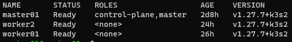
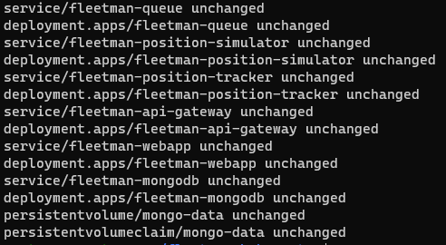
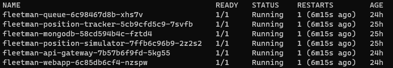
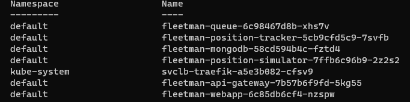

# fleetman-kubernetes
Projet Kubernetes 4KUBE

## Prerequis :

- Créer 3 VM sous Ubuntu Server
  - image : ubuntu-22.04.2-live-server-amd64.iso
  - interface réseau : NAT
  - 1 master et 2 worker

## Configuration

### Installation K3S
- cluster-master  
  - Entrer en mode admin

    ```bash 
    sudo su 
    ```
  - Installation de K3S
    ```bash 
    curl -sfL https://get.k3s.io | sh -
    ```

### Création du cluster

- cluster-master  
  - Récupération du token
    ```bash 
    sudo cat /var/lib/rancher/k3s/server/node-token
    ```

- cluster-worker1 et cluster-worker2 
  - Installation de K3S et connection au cluster 
    ```bash 
    curl -sfL https://get.k3s.io | K3S_TOKEN="[CHANGER]" K3S_URL="https://[CHANGER]:6443" K3S_NODE_NAME="[CHANGER]" sh -
    ```
     - K3S_TOKEN : token du node master
     - K3S_URL : ip du node master
     - K3S_NODE_NAME : nom de la vm worker (‘worker0’ ou ‘worker1’)

- cluster-master : Vérification de la création du cluster
    ```bash 
    kubectl get nodes
    ```
    

### Déploiement du projet
- cluster-master : Exécution des manifestes
    ```bash 
    kubectl apply -f .
    ```    
    

- cluster-master : Vérification du déploiement 
    ```bash 
    kubectl get pods
    ```    
    

- cluster-master : Vérifications des worker
    ```bash 
    kubectl describe node worker01
    kubectl describe node worker02
    ```    
    

### Ressource

[K3S](https://docs.k3s.io/quick-start)
